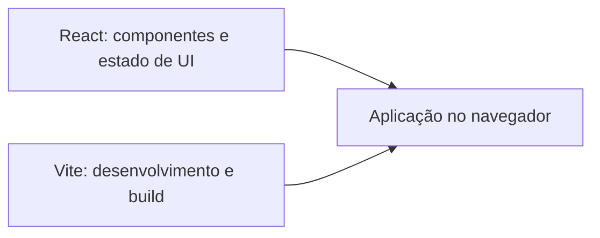
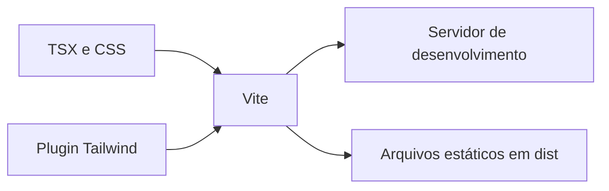
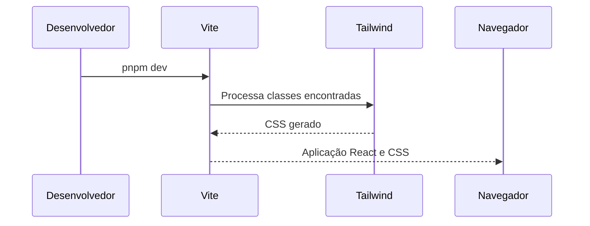

# Fundação: Vite, TypeScript e Tailwind CSS

> Status: em andamento. Este capítulo será atualizado quando o Módulo 1 estiver concluído.

## Objetivo

Estabelecer uma base React com TypeScript e Vite, capaz de iniciar localmente e gerar um build de produção. Adicionar Tailwind CSS como a camada de estilos da POC.

## Resumo

- O projeto foi criado com o template `react-ts` do Vite.
- O Node.js foi atualizado para a versão 24.18.0, compatível com o Vite atual.
- O gerenciador de pacotes escolhido é o pnpm.
- Tailwind CSS v4 foi integrado por meio do plugin oficial para Vite.
- ESLint foi configurado para JavaScript, TypeScript, Hooks e Fast Refresh.
- Prettier foi instalado com versão exata e integrado ao ESLint.
- O build de produção foi validado com `pnpm build`.

## Decisão arquitetural: por que Vite e não Next.js?

Esta POC usa **React com Vite**, e não Next.js, porque o objetivo é estudar os fundamentos de uma aplicação React client-side sem que um meta-framework decida partes importantes da arquitetura.

Next.js é uma excelente escolha quando o produto precisa de renderização no servidor (SSR), geração estática, SEO forte, rotas baseadas em arquivos, endpoints de backend ou recursos integrados de servidor. Porém, ele introduz conceitos que não são o foco deste laboratório: Server Components, fronteiras entre cliente e servidor, convenções de roteamento e estratégias de rendering.

Com Vite, precisaremos escolher e configurar explicitamente bibliotecas como React Router, TanStack Query e a organização do projeto. Esse esforço é intencional: ele torna visível o papel de cada ferramenta e ajuda a explicar decisões em uma entrevista técnica.

| Escolha      | Vantagem                                     | Trade-off                                                                   |
| ------------ | -------------------------------------------- | --------------------------------------------------------------------------- |
| Next.js      | Convenções e recursos de servidor integrados | Menos exposição às decisões de uma SPA React; maior superfície de conceitos |
| React + Vite | Base leve, rápida e explícita para uma SPA   | Rotas, dados e outras capacidades precisam ser escolhidas e integradas      |

## Decisão arquitetural: Vite não substitui React

“React puro” pode significar duas coisas diferentes. Nesta POC, usamos React sem um meta-framework: não há Next.js, SSR nem backend integrado. Isso é React puro no sentido arquitetural.

Vite não é uma alternativa ao React. React é a biblioteca que descreve e atualiza a interface; Vite é a ferramenta que executa o servidor local, transforma TypeScript e JSX e gera o build de produção.



Seria possível usar React por CDN e escrever JavaScript sem Vite, mas isso não oferece uma experiência adequada para uma aplicação TypeScript moderna: não há build, tipagem integrada, HMR, controle de dependências ou otimização de produção. Para um exercício muito pequeno isso pode ser didático; para esta POC, Vite oferece a infraestrutura mínima sem assumir a arquitetura da aplicação.

## Problema que resolve

Uma aplicação React precisa de ferramentas para transformar TypeScript e JSX em arquivos que o navegador entende, atualizar a tela durante o desenvolvimento e gerar artefatos otimizados para publicação. O Vite fornece esse fluxo.

Tailwind evita que cada componente comece com um arquivo CSS próprio e permite compor estilos responsivos com utilities, sem adicionar JavaScript ao runtime da aplicação.

## Como funciona



1. `src/main.tsx` monta o React no elemento `#root`.
2. `src/index.css` importa Tailwind com `@import 'tailwindcss'`.
3. O plugin `@tailwindcss/vite` identifica classes usadas nos arquivos do projeto.
4. O Vite entrega CSS e JavaScript processados no desenvolvimento ou no build.

## Quando utilizar

- Vite: aplicações React client-side, POCs, SPAs e bibliotecas de interface.
- TypeScript: projetos que se beneficiam de contratos explícitos e feedback antecipado.
- Tailwind: equipes que aceitam utilities no JSX e querem construir interfaces consistentes rapidamente.

## Quando NÃO utilizar

- Vite sozinho não substitui recursos de servidor, autenticação ou SSR quando eles são requisitos do produto.
- Tailwind pode não ser a melhor escolha quando uma equipe já possui um design system encapsulado ou prefere CSS sem classes utilitárias no JSX.

## Vantagens

- Inicialização e atualização rápida durante o desenvolvimento.
- Tipagem estática para componentes e dados.
- CSS gerado apenas para as utilities utilizadas.
- Configuração inicial pequena.

## Desvantagens

- Vite exige ferramentas adicionais para rotas, estado remoto e testes.
- Classes Tailwind longas podem prejudicar a leitura quando um componente cresce demais.
- O carregador nativo de configuração usado neste projeto é experimental no Vite.

## Trade-offs

Usamos Tailwind v4 com o plugin Vite em vez de PostCSS porque é a integração oficial mais direta para um projeto novo. Em troca, os estilos ficam próximos ao JSX; a disciplina passa a ser manter componentes pequenos e extrair componentes, não criar classes CSS genéricas cedo demais.

O Vite 8 tentou empacotar o plugin Tailwind com Rolldown e falhou ao interpretar um binário nativo no Windows. Por isso, os scripts usam `--configLoader native`, suportado pelo Node 24. Alterações na configuração podem exigir reiniciar o servidor.

## O que foi implementado na POC

- Vite + React + TypeScript.
- pnpm e lockfile `pnpm-lock.yaml`.
- Tailwind CSS e `@tailwindcss/vite` como dependências de desenvolvimento.
- Uma tela mínima para validar utilities do Tailwind.
- ESLint com configuração flat em `eslint.config.js`.
- Prettier com `.prettierrc.json`, `.prettierignore` e scripts de escrita e verificação.
- Scripts `dev`, `build` e `preview` com carregamento nativo da configuração.

## Estrutura criada

```text
src/
  App.tsx       # Tela raiz temporária para validar a fundação
  index.css     # Importa Tailwind
  main.tsx      # Ponto de entrada React
vite.config.ts  # Plugins do React e Tailwind
eslint.config.js # Regras de análise estática
.prettierrc.json # Convenções de formatação
.prettierignore  # Artefatos que não devem ser formatados
docs/           # Capítulos de aprendizado e status da POC
```

## Fluxo de execução



## Boas práticas

- Usar um único gerenciador de pacotes: pnpm.
- Versionar o lockfile.
- Executar `pnpm build` antes de considerar uma etapa concluída.
- Executar `pnpm lint` antes de enviar alterações para revisão.
- Executar `pnpm format:check` no CI; usar `pnpm format` para aplicar a formatação localmente.
- Usar HTML semântico antes de adicionar ARIA.
- Manter classes Tailwind relacionadas próximas e extrair componentes quando o JSX perder legibilidade.

## Erros comuns

- Misturar `npm install` e `pnpm install`, gerando lockfiles concorrentes.
- Ignorar avisos de versão incompatível do Node.
- Remover o lockfile para “resolver” qualquer problema de instalação.
- Criar configurações Tailwind extensas sem uma necessidade concreta.
- Usar ESLint e Prettier como se fossem a mesma ferramenta.
- Usar uma `div` clicável em vez de um elemento semântico, como `button`.

## Perguntas de entrevista

1. **Qual problema o Vite resolve?**  
   Processa e entrega a aplicação durante o desenvolvimento e gera os arquivos estáticos otimizados para produção.
2. **Por que React está em `dependencies` e Vite em `devDependencies`?**  
   React é necessário para a aplicação renderizar; Vite é necessário para desenvolver e gerar o build.
3. **O que é `type: module` no `package.json`?**  
   Indica que o Node deve usar o sistema moderno de módulos ECMAScript, com `import` e `export`.
4. **O que Tailwind gera em runtime?**  
   Nenhum runtime JavaScript: as classes são transformadas em CSS durante o processo de build.
5. **Quando PostCSS pode ser preferível ao plugin Vite do Tailwind?**  
   Quando o projeto já possui uma cadeia PostCSS necessária por outros plugins ou uma configuração legada estabelecida.
6. **Por que manter o lockfile no repositório?**  
   Para que ambientes diferentes instalem versões idênticas das dependências resolvidas.
7. **Qual a diferença entre ESLint e Prettier?**  
   ESLint encontra problemas e padrões de código; Prettier aplica uma formatação consistente.
8. **Por que usar `eslint-config-prettier`?**  
   Para desligar regras de estilo do ESLint que poderiam disputar a mesma decisão com o Prettier.

## Checklist

- [x] Projeto React + TypeScript criado.
- [x] Node atualizado e compatível com o Vite.
- [x] pnpm definido como gerenciador de pacotes.
- [x] Tailwind CSS configurado.
- [x] ESLint configurado e validado.
- [x] Prettier configurado e validado.
- [x] Build de produção executado com sucesso.
- [ ] Vitest e React Testing Library configurados.
- [ ] Capítulo revisado e módulo concluído.

## Referências

- [Vite: Getting Started](https://vite.dev/guide/)
- [Vite: Configuring Vite](https://vite.dev/config/)
- [Tailwind CSS: Using Vite](https://tailwindcss.com/docs/installation/using-vite)
- [React: TypeScript](https://react.dev/learn/typescript)
- [pnpm: Introduction](https://pnpm.io/motivation)
- [Prettier: Install](https://prettier.io/docs/install)
